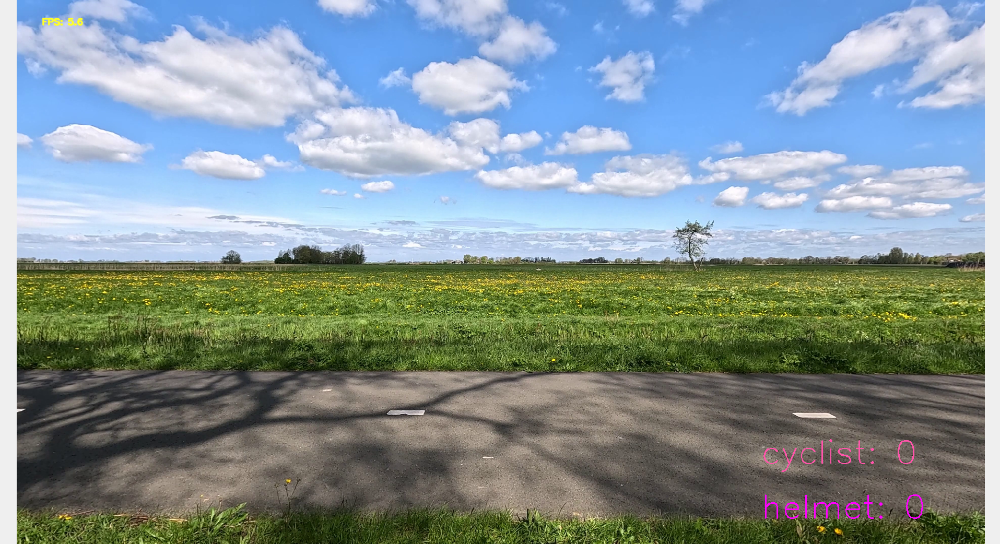

# Bike Helmet Detection and Cyclist Counting System

Welcome to the repository containing code to count bikehelmets and cyclists in videos This guide is designed to help you navigate and utilize these demos.

# Table of Contents
1. [Introduction](#introduction)
2. [Setting Up Your Environment](#setting-up-your-environment)
3. [Creating a Conda Environment](#creating-a-conda-environment)
4. [Activating the Environment](#activating-the-environment)
5. [Installing Required Packages](#installing-required-packages)
6. [Demos Overview](#demos-overview)
   - [Gradio Demo](#gradio-demo)
   - [CLI Application](#cli-application)

## Introduction

This repository contains code to detect and count bike helmets and cyclists from video streams using a machine learning model. The system can be run either in real-time via a webcam or on pre-recorded video footage. Additionally, it provides two methods of interaction: a user-friendly web interface built with Gradio and a command-line interface (CLI).

## Setting Up Your Environment

Before diving into the demos, you'll need to set up your environment. We recommend using Conda, a popular package and environment management system. 
If you don't have Conda installed, you can download it from the Miniconda website (a minimal installer for Conda).

## Cloning the Repository

First, clone the repository to your local machine using the following command (This assumes you have Git installed from https://git-scm.com/downloads):

```bash
git clone https://github.com/imaihub/traffic-safety-helmet-counting.git
cd traffic-safety-helmet-counting
```

## Creating a Conda Environment

Once Conda  is installed (from https://www.anaconda.com/download), you can create a new environment specifically for running these demos. We'll use Python 3.12 for this environment.
Open your terminal (Command Prompt on Windows, Terminal on Linux), and run the following command:

```bash
conda create -n bikehelmets python=3.12
```

## Activating the Environment

Activate the newly created environment using the command:

``conda activate bikehelmets``

## Installing Required Packages

With the environment activated, you'll need to install the necessary Python packages. These are listed in a requirements.txt file provided in the repository. 
Ensure you're in the repository's root directory in your terminal, then run:

```bash
pip install -r requirements.txt
```

If you are on Windows and wish to use the GPU for the processing, you have to install torch using the following instructions from https://pytorch.org/get-started/locally/

```bash
# Boxmot requires these versions of PyTorch
pip install torch==2.2.2 torchvision==0.17.2 torchaudio==2.2.2 --index-url https://download.pytorch.org/whl/cu121
```

# Demo Overview

## Gradio Demo

Gradio allows you to interact with the machine learning model through a web interface. It's user-friendly and does not require coding knowledge.
Running the Gradio Demo

Navigate to the Gradio directory in your terminal, and run the demo script:

```bash
python gradio_server/server.py
```

```markdown
## Running the Gradio Demo
After running `python gradio_server/server.py`, you should see output similar to the following in your terminal:

```bash
Running on local URL: http://127.0.0.1:7860
Press CTRL+C to quit
```

Then, open the URL http://127.0.0.1:7860 in your browser to access the Gradio web interface.


## CLI Application

This code also supports analyses through a CLI script. 

Run the CLI script with 

```bash
python cli.py
```

If you want a local camera feed, add the argument --camera-mode like:

```bash
python cli.py --camera-mode
```

Note: If it does not work on Linux, make sure to install v4l-utils with

```bash
sudo apt install v4l-utils
```

If you want an analysis of a video file, add an --input argument pointing to the video file like:

```bash
python cli.py --input /path/to/video.mp4
```

Below is a list of the relevant arguments. Some arguments are flags, others need a value, specified by the italic value after the argument.

General:
- --realistic: Help ease down the processing speed to make the resulting video seem realistic, in case of very good hardware
- --gpu: Use GPU for processing, else the CPU is used
- --screen-width: Screen width in pixels for visualization, standard 1920
- --screen-height: Screen height in pixels for visualization, standard 1080

Camera:
- --camera-mode: Use USB webcam/camera as input
- --camera-index: Index of camera to use, -1 is automatic discovery"
- --save-all-frames: Save all raw frames from camera as separate .png files
- --save-results: Construct an .mp4 file with all processed images
- --save-new-objects: Save all frames with new objects as .png files"
- --reset-stats-min: Automatically reset counts every x minutes

File input:
- --input: Use video file as input, looks in dataset folder only. So first copy file there and put the file name as an argument


Here is an example of what you will see:

